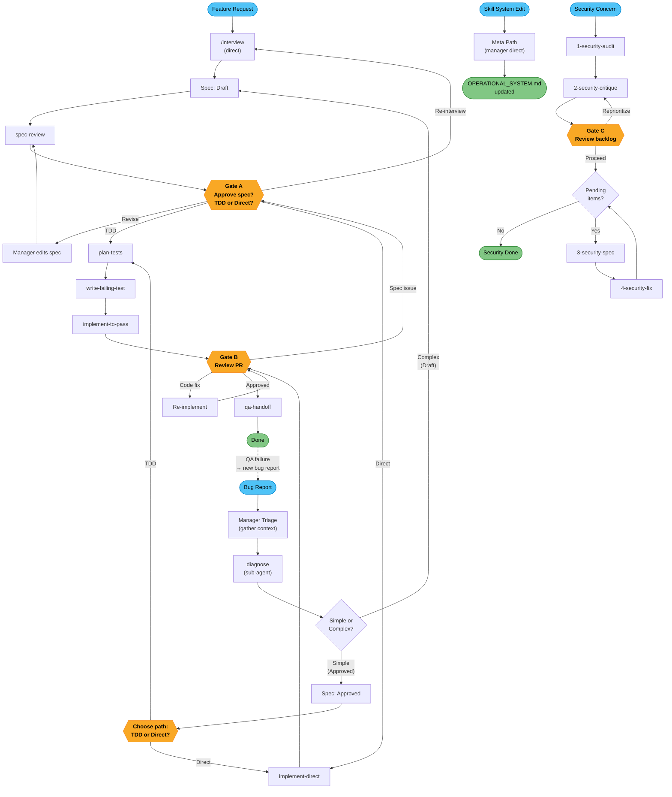
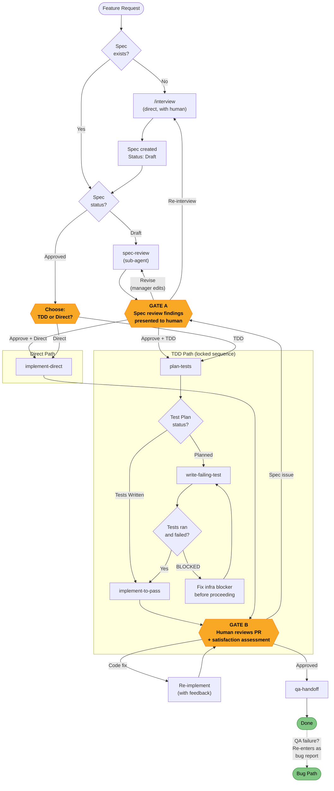
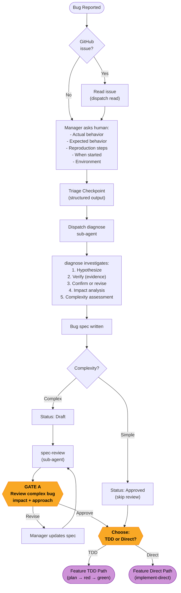
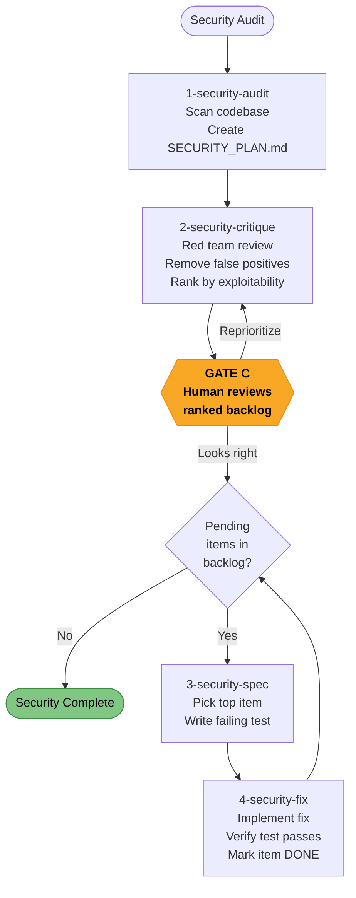
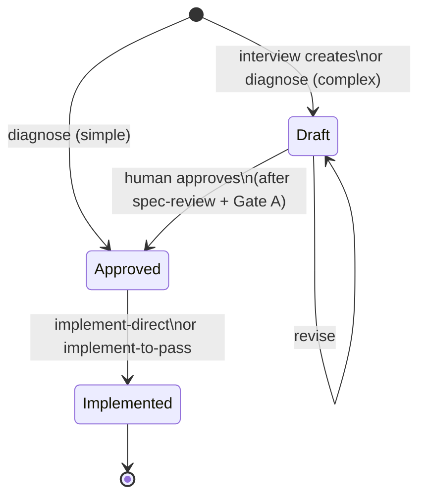
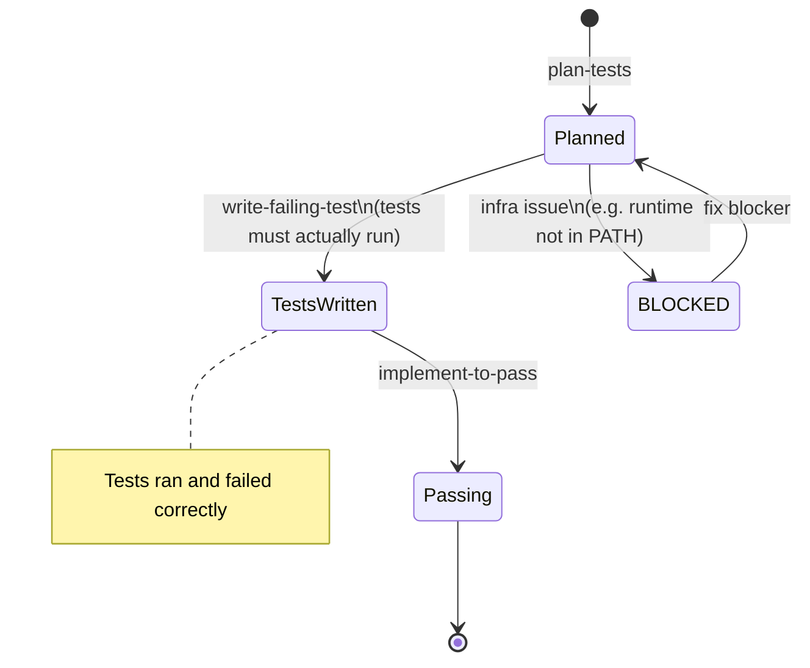
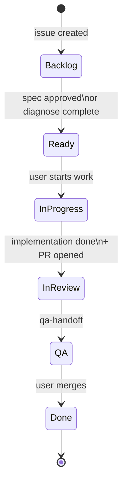

# Workflow System — Visual Map

> Generated from `workflow-router/SKILL.md` and all skill contracts. Keep in sync when paths change.

---

## Master Overview

All four entry points, how they converge, and where they terminate. Human gates are hexagons.

---

## Feature Path — Detail

Two branches (TDD and Direct) from a single approval gate. TDD is a locked sequence.

---

## Bug Path — Detail

Manager triages, sub-agent investigates, complexity determines routing. Both branches converge into the Feature implementation paths.

---

## Security Path — Detail

4-phase pipeline with a fix loop. Isolated from feature/bug paths (uses SECURITY_PLAN.md, not specs).

---

## Status State Machines

Three independent status tracks. Each is a strict progression — no skipping or reordering.

### Spec Status

### Test Plan Status

### GitHub Issue Status

---

## Observations

What jumps out from seeing the system visually.

### Solid

- **Bug → Feature convergence** is clean. Both paths arrive at "Approved spec → choose TDD or Direct" — same implementation skills, same gates. No special bug-specific implementation path needed.
- **Security isolation** is airtight. Completely separate state machine, no accidental crossover.
- **Human gates** are well-placed: after design (A), after implementation (B), after security triage (C). No automation runs without approval at the right moment.
- **TDD sequence** is locked and verified — the BLOCKED state prevents false advancement.

### Gaps & Opportunities

1. ~~**"Revise" at Gate A is underspecified.**~~ **Addressed.** Gate A now has separate "Revise" (manager edits spec, re-dispatches spec-review) and "Re-interview" (full restart) options. Feature path is now consistent with bug path, which already had this pattern.

2. **No dedicated refactor path.** Diagnosis flags code smell → complex bug → spec-review → Gate A. But "fix the bug" and "address the underlying code smell" are different scopes. The human has to manually scope down at Gate A. A refactor could be a separate spec/issue rather than bundled into the bug fix.

3. ~~**Gate B "changes needed" is a black box.**~~ **Addressed.** Gate B now asks "what kind of change?" and routes to code fix (re-implement), re-test, or spec issue (back to Gate A).

4. **No pre-interview path.** Feature starts at `interview` which expects you to know what you want. There's no brainstorm/discovery/exploration phase for "I have a vague idea." The user has to do that thinking externally before entering the system.

5. **Meta Path has no quality gate.** Features get spec-review, security gets critique, but skill system edits go straight from "make changes" to "update OPERATIONAL_SYSTEM.md." For a solo founder this is fine (you are the gate), but worth noting the asymmetry.

6. ~~**qa-handoff is terminal but there's no "QA failed" re-entry.**~~ **Addressed.** QA failures re-enter as new bug reports through the Bug Path. Now explicit in diagrams (dashed re-entry edge) and workflow-router constraints.

7. **No "skip" affordance.** The human can redirect the manager at any time, but there's no explicit "skip spec-review" or "skip tests" shortcut. The manager protocol says workflow steps are flexible, but the decision trees don't show skip edges.
